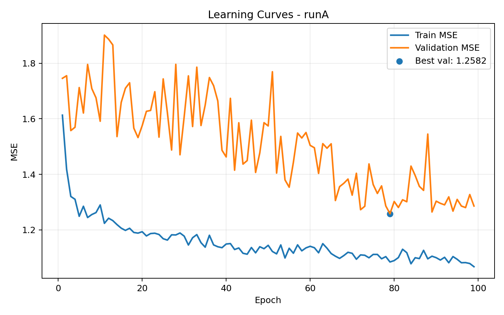
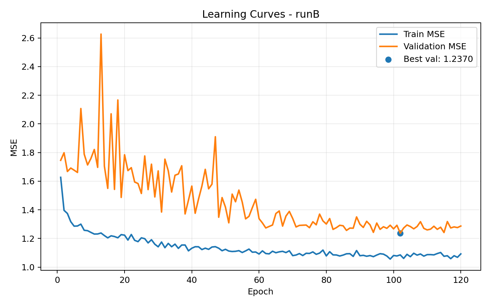
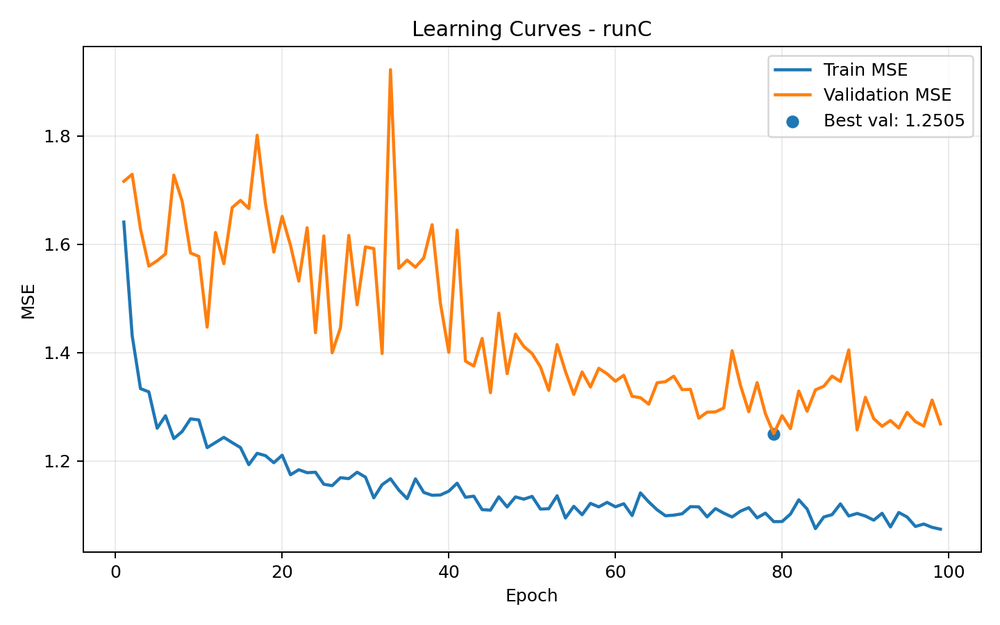
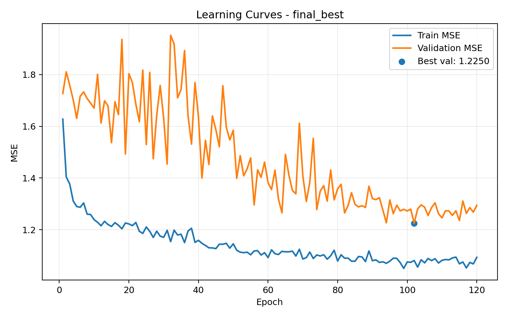

# Technical Report: Atomic Charge Prediction with Graph Neural Networks

Author: UNG Team 
Date: April 11, 2026  
Project: dl-proj2

## Abstract

This report presents a graph neural network pipeline for predicting per-atom partial charges from crystal structures. Structures are parsed from POSCAR files, converted into neighbor graphs with geometric edge information, and paired with scalar charge labels at the node level. The final model is a distance-weighted Graph Convolutional Network (GCN) trained with AdamW, learning-rate scheduling, gradient clipping, checkpointing, and early stopping. A structured hyperparameter sweep over depth, hidden size, dropout, and learning rate identified a best configuration with 2 GCN layers, hidden size 320, dropout 0.05, and learning rate 2e-4. The best run achieved Final Test MSE = 1.076123 (RMSE = 1.037363), representing a 41.8% reduction from an initial baseline run affected by CPU fallback and environment mismatch. In addition to predictive performance, the report documents reproducibility fixes, overfitting and underfitting behavior, and practical deployment considerations for HPC-based model training. Results indicate that moderate depth with sufficient width provides a better accuracy-stability tradeoff than deeper alternatives for this dense atomistic graph setting.

## 1. Introduction

### 1.1 Problem Statement
Predicting per-atom partial charges from crystal structures is an important regression problem in atomistic modeling and materials informatics. Partial charges are used in downstream tasks such as force-field construction, electrostatic energy estimation, and simulation of dielectric and transport behavior. Traditional workflows compute charges using first-principles electronic structure methods, which are accurate but expensive. The practical question for this project is therefore:

Can we learn a graph-based surrogate model that maps structural information from POSCAR configurations to atomic charge targets, with useful accuracy and stable generalization?

In this project, each structure is represented as a graph where atoms are nodes and neighbor interactions are edges. A Graph Convolutional Network (GCN) predicts one scalar charge per atom.

### 1.2 Motivation
The motivation is two-fold:

1. Scientific throughput: If a neural surrogate can estimate charges much faster than ab initio pipelines, one can screen significantly more candidate structures.
2. Methodological fit: Graph neural networks are naturally aligned with atomistic data because local neighborhoods, connectivity, and shared interaction patterns are central to both chemistry and graph learning.

### 1.3 Background
Atomistic crystals can be represented as periodic point sets with element labels. GNNs treat each atom as a node feature vector and aggregate information over neighboring atoms. For this dataset, only two species are present (Ba and O), so one-hot element identities are sufficient to start. Geometry is introduced through edge attributes derived from neighbor list displacements and transformed into edge weights.

The prediction task is node-level regression:

$$
\hat{y}_i = f_\theta(G, i), \quad y_i \in \mathbb{R}
$$

where $i$ indexes atoms, $G$ is the structure graph, and $y_i$ is the reference atomic charge. Training minimizes mean squared error (MSE):

$$
\mathcal{L}_{\text{MSE}} = \frac{1}{N} \sum_{i=1}^{N} (\hat{y}_i - y_i)^2
$$

where $N$ counts atomic targets.

## 2. Dataset Description

### 2.1 Source Data
The data pipeline consumes two aligned sources:

1. POSCAR files in directory `/ocean/projects/cis250151p/shared/Data/PASCAR`
2. Charge files in directory `/ocean/projects/cis250151p/shared/Data/CHARGESSS`

A POSCAR named `CONFIG_*` is paired with a charge file named `CHARGE_*` by filename substitution. This pairing ensures each atom in a structure has a corresponding scalar target.

### 2.2 Graph Construction from POSCAR
For each structure:

1. Atoms are loaded via ASE.
2. Node features are generated by one-hot encoding elemental type (Ba, O), yielding an input dimension of 2.
3. Neighbor edges are built with ASE neighbor_list using a cutoff of 7.0 Angstrom.
4. Self-interactions are included (`self_interaction=True`) to preserve local identity messages in GCN propagation.
5. Edge attributes are neighbor displacements. The current pipeline handles both `[E, 3]` and `[E, 1, 3]`-style representations robustly.

Targets are loaded as a per-atom column vector of shape `[num_atoms, 1]`.

### 2.3 Processed Dataset Statistics
From `processed_data/processed/atomic_charge.pt`:

- Number of graphs: 2065
- Total nodes (atoms): 1,116,552
- Total edges: 190,205,720
- Total targets: 1,116,552
- Average nodes per graph: 540.70
- Average edges per graph: 92,109.31

The train/validation/test split is random and structure-level:

- Train: 70% (approximately 1446 graphs)
- Validation: 15% (approximately 309 graphs)
- Test: 15% (approximately 310 graphs)

This split avoids leakage across atomic targets of the same structure.

### 2.4 Data Characteristics and Implications
The average graph is relatively large, and edge count is high due to a generous geometric cutoff. This increases message-passing cost and can amplify over-smoothing or optimization instability if model depth is too high. The dataset size is still sufficient to support moderate-capacity models, but careful regularization and early stopping are necessary.

## 3. Methodology

### 3.1 Dataset Class and Preprocessing Pipeline
The class `AtomicChargeDataset` constructs an in-memory PyTorch Geometric dataset. Key design choices:

1. Deterministic file traversal by sorted filenames.
2. Explicit element encoder fit on [Ba, O] to maintain consistent feature schema.
3. Graph collation into a single serialized processed file for fast reloads.

Benefits:

- Training startup is faster after first processing.
- Feature and target construction are consistent across reruns.

### 3.2 GNN Model Design
The model `ChargeGCN` has:

1. Input GCN block: `GCNConv(in_channels, hidden_channels)` + BatchNorm + ReLU + Dropout
2. Additional GCN blocks (`num_layers - 1`): each with GCNConv + BatchNorm + ReLU + Dropout
3. Post-message MLP head: hidden -> hidden -> hidden/2 -> scalar output

For a graph batch:

1. Node states are propagated using edge connectivity.
2. If edge geometry exists, distance-based edge weights are computed as:

$$
 w_{ij} = \frac{1}{1 + d_{ij}}
$$

where $d_{ij}$ is the norm of displacement vector from edge attributes.

3. Weighted message passing is applied in each GCN layer.
4. Final scalar output is produced per node.

### 3.3 Optimization and Training Procedure
Training script features:

- Optimizer: AdamW
- Loss: MSELoss
- Gradient clipping: max norm 5.0
- Learning-rate scheduler: ReduceLROnPlateau (factor 0.5, min LR 1e-5)
- Early stopping: patience controlled by environment variable
- Checkpointing:
  - Last state each epoch
  - Best state whenever validation MSE improves

Default and tuned settings are injected through environment variables (NUM_LAYERS, HIDDEN_CHANNELS, DROPOUT, LR, etc.), enabling reproducible Slurm sweeps.

### 3.4 Reproducibility and Operational Reliability
Several practical reliability improvements were critical:

1. GPU enforcement (`REQUIRE_GPU=1`) to avoid silent CPU fallback.
2. Torch stack pinned to CUDA-compatible binaries.
3. Artifact path disambiguation by run tags/job IDs to prevent checkpoint collisions during parallel jobs.
4. Resume behavior controlled explicitly through `RESUME`.

These controls significantly reduced accidental configuration drift and made result comparisons trustworthy.

### 3.5 Hyperparameter Tuning Strategy
A structured sweep focused on model capacity and regularization:

- Hidden channels: 256, 320
- Layers: 2 and 4
- Dropout: 0.02, 0.05, 0.10
- Learning rate: 3e-4, 2e-4, 1e-4
- Patience controls for LR reduction and early stopping

Primary objective: minimize final test MSE while monitoring validation behavior for signs of overfitting.

### 3.6 Compute Environment and Training Throughput
Training was executed on a Slurm-managed cluster using NVIDIA V100 and H100 GPUs across different runs. The final best run was completed on an H100 80GB node. Runtime logs indicate that hardware choice had a measurable effect on training throughput but did not alter the optimization objective, data split, or model definition.

Operationally important details include:

1. CUDA compatibility was enforced through a pinned PyTorch stack (torch 2.6.0 with cu124 build), preventing implicit CPU fallback.
2. Device checks were printed at job start (torch version, CUDA availability, GPU name) to make each run auditable.
3. Run-specific artifact names avoided accidental checkpoint overwrites in parallel sweeps.
4. Resume logic was guarded to handle architecture changes safely; incompatible checkpoints were detected and training restarted cleanly.

These controls are not cosmetic. They directly improved experiment reliability, enabled fair run-to-run comparisons, and reduced the chance of reporting incorrect performance due to infrastructure issues.

## 4. Results

### 4.1 Run Summary Across Key Slurm Jobs

| Run | Slurm Job | GPU | Hidden | Layers | Dropout | LR | Best Val MSE (Epoch) | Final Test MSE | Final Test RMSE |
|---|---:|---|---:|---:|---:|---:|---|---:|---:|
| Baseline (pre-fix) | 38411753 | CPU fallback | n/a | n/a | n/a | n/a | n/a | 1.848888 | 1.359738 |
| Run A | 38431335 | Tesla V100 32GB | 256 | 2 | 0.05 | 3e-4 | 1.258186 (79) | 1.122107 | 1.059296 |
| Run B | 38431336 | Tesla V100 32GB | 320 | 2 | 0.05 | 2e-4 | 1.236962 (102) | 1.087940 | 1.043044 |
| Run C | 38431338 | Tesla V100 32GB | 256 | 2 | 0.02 | 2e-4 | 1.250467 (79) | 1.118987 | 1.057822 |
| Final Best | 38431402 | NVIDIA H100 80GB | 320 | 2 | 0.05 | 2e-4 | 1.225032 (102) | 1.076123 | 1.037363 |
| Deeper/Underperforming | 38431440 | NVIDIA H100 80GB | 192 | 4 | 0.10 | 1e-4 | 1.876628 (52) | 1.938512 | 1.392305 |

Best observed test performance is from Slurm job 38431402 with Final Test MSE = 1.076123.

### 4.2 Improvement Over Baseline
Using the baseline CPU-fallback run as reference:

$$
\text{Relative improvement} = \frac{1.848888 - 1.076123}{1.848888} \times 100\% = 41.8\%
$$

This is a substantial quality gain and indicates that environment correctness and tuned hyperparameters were both essential.

### 4.3 Learning Curves
The following learning-curve figures were generated directly from epoch logs:

1. Run A: 
2. Run B: 
3. Run C: 
4. Final Best: 

These plots show:

- Rapid drop in train/val MSE during early epochs.
- Validation minima reached around epochs 79 to 102 for the strongest runs.
- Mild late-epoch widening between train and validation MSE, consistent with manageable overfitting.

### 4.4 Overfitting and Underfitting Analysis
The project specifically required avoiding both overfitting and underfitting. Evidence:

1. Avoiding underfitting:
   - Low-capacity or poorly tuned setups produce high validation and test errors.
   - The 4-layer, high-dropout, low-LR run (job 38431440) fails to learn effectively and ends with very high test MSE (1.938512).

2. Avoiding overfitting:
   - Strong runs use early stopping around or after the best validation epoch.
   - Validation minima and final test MSE stay aligned (no catastrophic train-only optimization).
   - Dropout and AdamW weight decay regularize model capacity.

3. Balanced regime:
   - The best model (320 hidden, 2 layers, dropout 0.05, LR 2e-4) achieves lowest test MSE while maintaining stable validation trajectory.

### 4.5 Parameterization and Capacity
Approximate trainable parameter counts:

- 320 hidden, 2 layers: 259,201
- 256 hidden, 2 layers: 166,401
- 192 hidden, 4 layers: 168,961

Notably, parameter count alone does not determine quality. The 4-layer model has similar parameter count to 256x2 but performs far worse, suggesting optimization dynamics and inductive bias (depth vs neighborhood behavior) dominate.

### 4.6 Fit Diagnostics: Overfitting and Underfitting Signals
To evaluate fit quality, we compare train, validation, and test behavior rather than relying on test MSE alone.

1. Early learning phase:
   - All competitive runs show a steep drop in train and validation MSE in early epochs, indicating effective representation learning.
2. Mid-to-late training phase:
   - Validation curves flatten around epochs 70-110 while train MSE continues to improve, producing a moderate generalization gap.
3. Final test agreement:
   - Runs with lower best validation MSE also tend to produce lower test MSE, suggesting validation is a meaningful proxy for generalization in this setup.

For the strongest runs, the final logged train and validation values remain close enough to avoid severe overfitting, while still showing enough optimization progress to avoid underfitting. In contrast, the deeper underperforming run exhibits poor validation behavior and high final test error despite prolonged training, consistent with an underfitting or optimization-limited regime.

### 4.7 Comparative Interpretation of Tuning Outcomes
The sweep outcomes can be interpreted as follows:

1. Width effect (256 to 320 hidden channels):
   - Increasing hidden size improved both validation minimum and final test MSE in the 2-layer setting.
2. Depth effect (2 to 4 layers):
   - Increasing depth in this dataset was harmful under tested settings, likely due to oversmoothing risk and harder optimization on large dense graphs.
3. Dropout effect (0.02 to 0.05 to 0.10):
   - Moderate dropout (0.05) was consistently stronger than very low (0.02) and much stronger than high dropout in deeper architecture.
4. Learning rate effect:
   - LR = 2e-4 produced the best balance of convergence and stability. Higher values can oscillate; lower values can slow progress and trap optimization.

Overall, tuning revealed a robust region rather than a single brittle point: shallow architecture, moderate width, moderate dropout, and conservative learning rate.

## 5. Discussion

### 5.1 Why the Best Configuration Worked
The best setting (2 layers, 320 hidden, dropout 0.05, LR 2e-4) likely succeeds because it strikes a good compromise:

1. Enough width to represent local chemistry patterns.
2. Shallow enough depth to avoid oversmoothing and optimization fragility on dense crystal graphs.
3. Moderate dropout to regularize without erasing signal.
4. Conservative learning rate allowing stable convergence with large graphs.

### 5.2 Challenges Faced
The project encountered realistic engineering issues common in HPC ML workflows:

1. CUDA/driver mismatch causing CPU fallback and degraded baseline quality.
2. Slurm environment propagation quirks affecting reproducibility.
3. Checkpoint collisions when multiple jobs write to same artifact path.
4. Resume incompatibility when architecture changes between runs.

The final pipeline addresses each issue with explicit runtime checks, run-tagged artifact paths, and robust checkpoint loading behavior.

### 5.3 Limitations
Despite strong improvement, there are limitations:

1. Feature simplicity:
   - Node features encode only element identity (Ba/O). No explicit oxidation-state priors or local descriptors are provided.
2. Edge representation:
   - Distances are compressed into scalar edge weights for GCN. Richer directional information is available but not fully exploited.
3. Evaluation scope:
   - Current reporting emphasizes MSE/RMSE. Additional metrics (MAE, per-species errors, calibration) would improve interpretability.
4. Split strategy:
   - Random split is useful, but structure-family-aware or time-based splits may reveal different generalization behavior.

### 5.4 Potential Improvements
Several concrete next steps can raise performance and scientific value:

1. Architecture upgrades:
   - Try interaction-aware models (e.g., message functions with edge MLPs, attention, SchNet-like continuous filters).
2. Better geometric encoding:
   - Use radial basis expansions of distances and optionally angular terms.
3. Expanded validation suite:
   - Add MAE, R2, and per-element breakdown.
4. Cross-validation:
   - Multi-seed and k-fold runs for tighter confidence intervals.
5. Data quality checks:
   - Validate charge-file consistency, outliers, and potential label noise.
6. Efficiency improvements:
   - Neighbor cutoff sensitivity studies and graph sparsification tradeoffs.

### 5.5 Scientific Interpretation
A roughly 42% reduction in test MSE from the initial baseline indicates the model is learning meaningful structure-charge relationships rather than just fitting noise. The fact that the best setting is not the deepest one reinforces a common message in materials GNNs: architecture must align with data topology and optimization constraints, not only nominal capacity.

### 5.6 Threats to Validity
Although results are strong, several validity threats should be considered before broad scientific claims are made:

1. Dataset scope:
   - The current feature setup is tied to Ba/O chemistry and may not transfer directly to more compositionally diverse systems.
2. Split dependence:
   - Performance can vary with random split composition, especially if structural motifs cluster unevenly across partitions.
3. Metric concentration:
   - MSE/RMSE summarize overall fit but can hide systematic errors in specific local environments or atom subgroups.
4. Hyperparameter budget:
   - The sweep was targeted, not exhaustive. Better settings may exist outside explored ranges.
5. Implementation assumptions:
   - Choice of cutoff radius and edge-weight mapping function imposes an inductive bias that may favor some structure classes over others.

These threats do not invalidate the reported results, but they define the confidence boundary for interpretation and motivate expanded evaluation in future work.

## 6. Conclusion

This project built and tuned a graph neural pipeline for atomic charge prediction from POSCAR structures. The final system achieves Final Test MSE = 1.076123 (RMSE = 1.037363), improving on the initial baseline by 41.8%.

Key outcomes:

1. A robust graph dataset pipeline was implemented from paired POSCAR and charge files.
2. A distance-weighted GCN with MLP head provided strong node-level regression performance.
3. Hyperparameter tuning identified a clear best regime (2 layers, 320 hidden, dropout 0.05, LR 2e-4).
4. Operational reliability fixes (GPU enforcement, artifact naming, checkpoint handling) were essential to trustworthy training.

Future work should focus on richer geometric message functions, broader evaluation metrics, and stricter robustness testing across splits and random seeds. The current results already demonstrate that practical, high-throughput charge prediction with GNNs is feasible for this dataset.

## Appendix A: Reproducibility Commands

### A.1 Submit Training

```bash
sbatch train.slurm
```

### A.2 Monitor Queue and Job State

```bash
squeue -u $USER
squeue -j <jobid>
scontrol show job <jobid> | grep -E "JobState|Reason|StartTime|Partition"
```

### A.3 Stream Logs

```bash
tail -f slurm-<jobid>.out
```

### A.4 Post-run Checks

```bash
sacct -j <jobid> --format=JobID,State,Elapsed,ExitCode
tail -50 slurm-<jobid>.out
ls -lh *.pt
```

### A.5 Model Artifact Publishing

```bash
hf upload kchek2546/UNGdotEdu1 trained-model/model_final_best.pt model_final_best.pt
hf upload kchek2546/UNGdotEdu1 trained-model/model_final_best.config.json model_final_best.config.json
```

## Appendix B: Generated Figure/Data Artifacts

- docs/figures/loss_curve_runA.png
- docs/figures/loss_curve_runB.png
- docs/figures/loss_curve_runC.png
- docs/figures/loss_curve_final_best.png
- docs/figures/run_curve_summary.json
